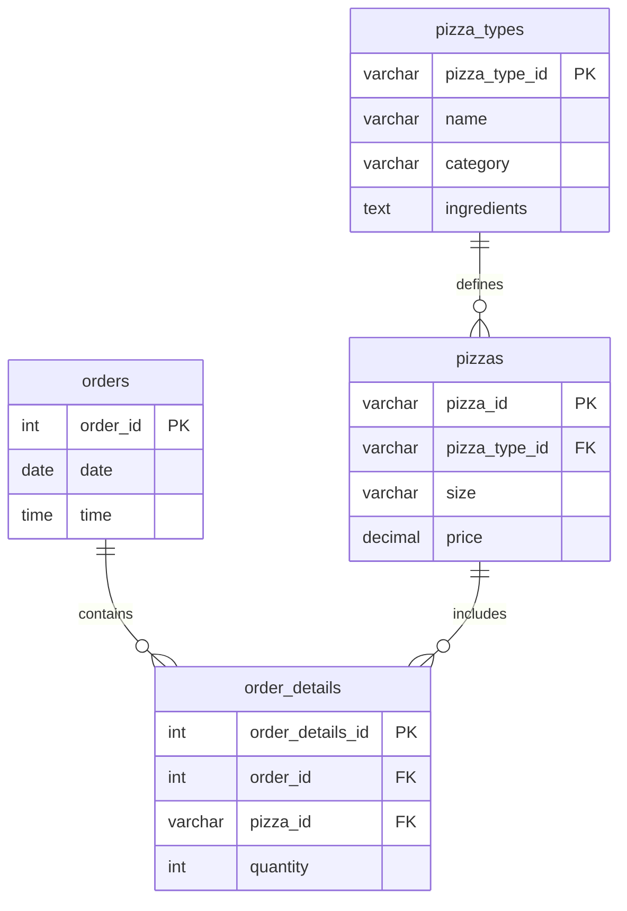

# 🍕 Pizza Sales Analysis with SQL

## 📌 Project Overview
This project analyzes pizza sales data using SQL queries.  
The goal is to explore **order patterns, revenue trends, and pizza category performance**.  
It covers **Basic, Intermediate, and Advanced SQL queries** for hands-on practice.

---

## 📂 Files in this Repository
- `pizza_db.sql` → Database dump file (schema + sample data)
- `queries.sql` → All SQL queries (basic → advanced)
- `Mini_Project.pdf` → Original problem statement (questions)

---

## 🛠️ Technologies Used
- **MySQL 8.0+**
- SQL concepts: Aggregations, Joins, Grouping, Window Functions

---

## 🔍 Questions Solved

### ✅ Basic Queries
1. Total number of orders placed  
2. Total revenue generated from pizza sales  
3. Highest-priced pizza  
4. Most common pizza size ordered  
5. Top 5 most ordered pizza types by quantity  

### 📊 Intermediate Queries
1. Total quantity of each pizza category ordered  
2. Distribution of orders by hour of the day  
3. Category-wise distribution of pizzas  
4. Average number of pizzas ordered per day  
5. Top 3 pizza types based on revenue  

### 🚀 Advanced Queries
1. Percentage contribution of each pizza type to total revenue  
2. Cumulative revenue generated over time  
3. Top 3 most ordered pizza types by revenue for each category  

---

## 📈 Key Insights
- Peak order hours can be identified to optimize staffing.  
- Large size pizzas contribute the highest revenue.  
- A few pizza types generate the majority of sales (Pareto principle).  
- Category-wise analysis shows customer preferences clearly.  

---

## 📷 Sample ER Diagram (for understanding schema)

---

## 🚀 How to Run this Project
1. Import `pizza_db.sql` into MySQL Workbench or any SQL client.  
2. Open `queries.sql` and run queries step by step.  
3. Observe outputs to validate business insights.  

---

## 👩‍💻 Author
**Safina Shah**  
SQL Mini Project — Pizza Sales Analysis  
